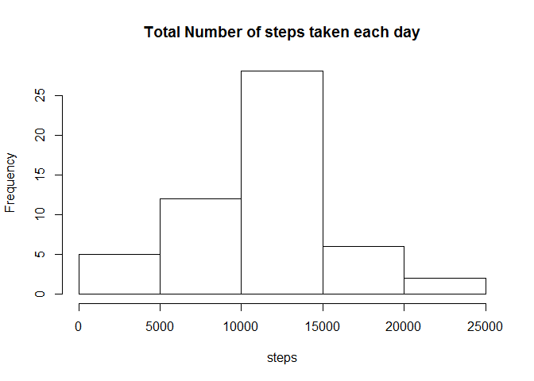
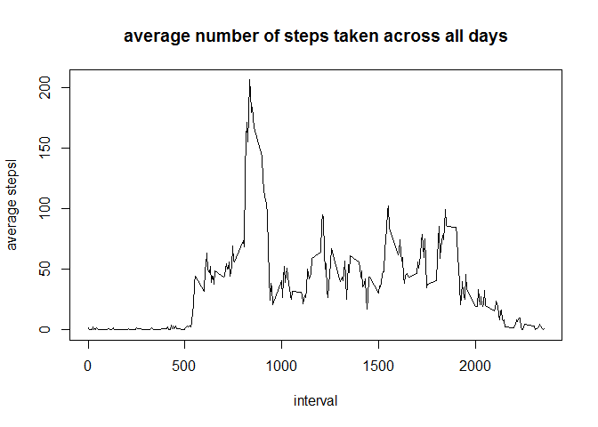
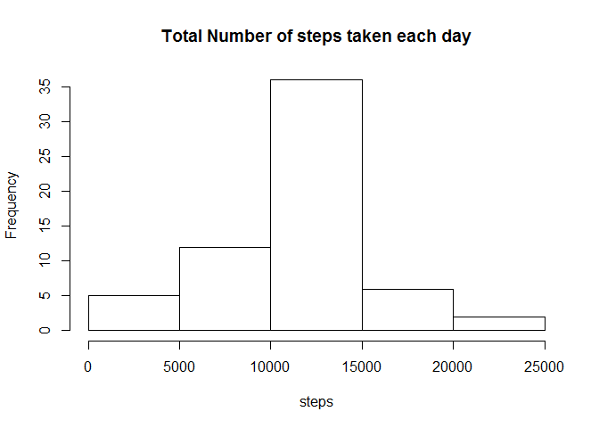
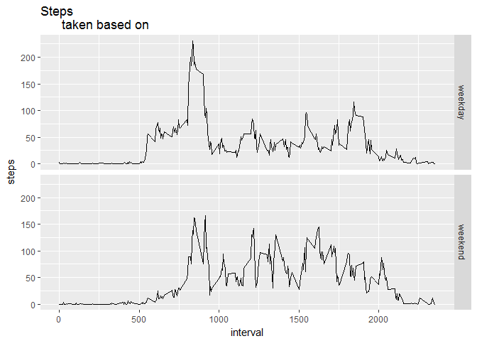

# Reproducible Research: Peer Assessment 1


## Loading and preprocessing the data

load the necessary libraries

```r
require("dplyr")
```

```
## Loading required package: dplyr
```

```
## 
## Attaching package: 'dplyr'
```

```
## The following objects are masked from 'package:stats':
## 
##     filter, lag
```

```
## The following objects are masked from 'package:base':
## 
##     intersect, setdiff, setequal, union
```

```r
require("ggplot2")
```

```
## Loading required package: ggplot2
```

read in csv file and convert the date column to Date format

```r
activity<-read.csv("activity.csv")
activity$date<-as.Date(as.character(activity$date),"%Y-%m-%d")
```

## What is mean total number of steps taken per day?

calculate the total number of steps taken per day using summarise function

```r
steps_pday<-summarise(group_by(activity,date),steps=sum(steps,na.rm = FALSE))
head(steps_pday)
```

```
## # A tibble: 6 × 2
##         date steps
##       <date> <int>
## 1 2012-10-01    NA
## 2 2012-10-02   126
## 3 2012-10-03 11352
## 4 2012-10-04 12116
## 5 2012-10-05 13294
## 6 2012-10-06 15420
```

plot the histogram for total number of steps taken each day

```r
hist(steps_pday$steps,main="Total Number of steps taken each day",xlab="steps")
```

<!-- -->

calculate the mean and median of total number of steps taken per day


```r
mean(steps_pday$steps,na.rm = TRUE)
```

```
## [1] 10766.19
```

```r
median(steps_pday$steps,na.rm = TRUE)
```

```
## [1] 10765
```

## What is the average daily activity pattern?

Make a time series plot of the 5-minute interval and the average number of steps taken, averaged across all days


```r
avg_steps_pday<-summarise(group_by(activity,interval),avg_steps=mean(steps,na.rm=TRUE))
plot(avg_steps_pday,type="l",main="average number of steps taken across all days",xlab="interval", ylab="average stepsl")
```

<!-- -->

The 5-minute interval, which contains the maximum number of steps is


```r
which.max(avg_steps_pday$avg_steps)
```

```
## [1] 104
```

## Imputing missing values
There are a number of days/intervals where there are missing
values (coded as `NA`). 


```r
length(which(is.na(activity$steps)))
```

```
## [1] 2304
```

The presence of missing days may introduce
bias into some calculations or summaries of the data, 
so here we fill the missing values
in the dataset with the mean for that 5-minute interval, and create a new 
dateset activity_new


```r
labeld_activity<-merge(activity,avg_steps_pday,by = "interval")
labeld_activity$steps[which(is.na(labeld_activity$steps))]<-
    labeld_activity$avg_steps[which(is.na(labeld_activity$steps))]
activity_new<-select(labeld_activity,interval,steps,date)
head(activity_new)
```

```
##   interval    steps       date
## 1        0 1.716981 2012-10-01
## 2        0 0.000000 2012-11-23
## 3        0 0.000000 2012-10-28
## 4        0 0.000000 2012-11-06
## 5        0 0.000000 2012-11-24
## 6        0 0.000000 2012-11-15
```

make a histogram based on the new dataset


```r
steps_pday_new<-summarise(group_by(activity_new,date),steps=sum(steps))
hist(steps_pday_new$steps,main="Total Number of steps taken each day",xlab="steps")
```

<!-- -->

The new mean and median value is


```r
mean(steps_pday_new$steps)
```

```
## [1] 10766.19
```

```r
median(steps_pday_new$steps)
```

```
## [1] 10766.19
```

## Are there differences in activity patterns between weekdays and weekends?

first the local time needs to be changed to English


```r
Sys.setlocale("LC_TIME","English")
```

```
## [1] "English_United States.1252"
```

add a new column call wk to dataset activity_new, which is a factor
with factor level *weekday*,*weekend*


```r
activity_new$wk<-(weekdays(activity_new$date) %in% c("Saturday","Sunday") ) %>% factor(labels=c("weekday","weekend"))
avg_steps_wday<-summarise(group_by(activity_new,interval,wk),steps=mean(steps))
head(avg_steps_wday)
```

```
## Source: local data frame [6 x 3]
## Groups: interval [3]
## 
##   interval      wk      steps
##      <int>  <fctr>      <dbl>
## 1        0 weekday 2.25115304
## 2        0 weekend 0.21462264
## 3        5 weekday 0.44528302
## 4        5 weekend 0.04245283
## 5       10 weekday 0.17316562
## 6       10 weekend 0.01650943
```

make a plot using ggplot package 


```r
qplot(interval,steps,data=avg_steps_wday,facets = wk~.,geom = "line",main = "Steps
      taken based on ")
```

<!-- -->

